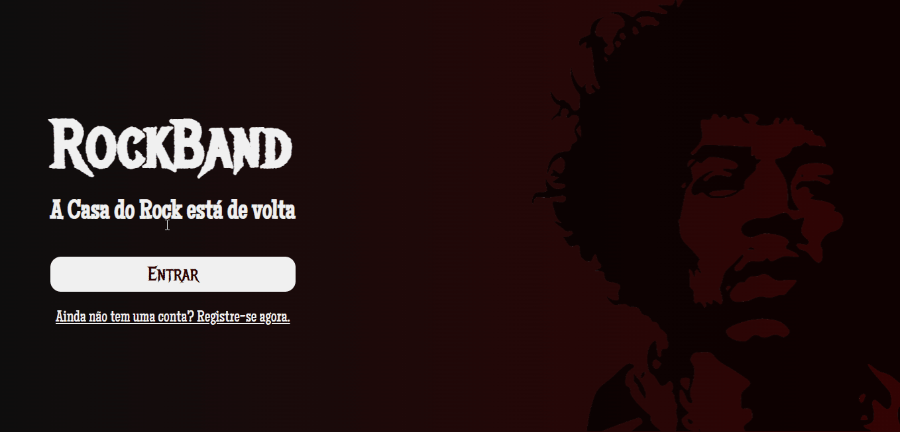

# RockBand 🤘

### Projeto pessoal feito para praticar HTML e CSS junto a comunidade de Alunos do Instituto Nu + Descomplica, onde fiz o design para desenvolvermos simultaneamente.

------------

## Sobre o projeto

Site de navegação podendo andar entre as telas, contendo Landing Page, Página de Login, Página de Cadastro e Página de Erro

------------

## Tecnologias Usadas

Para completar o desafio usei:
 - HTML
 - CSS
 - Tags Semânticas

------------

## O Projeto Rodando

#### Versão Desktop
